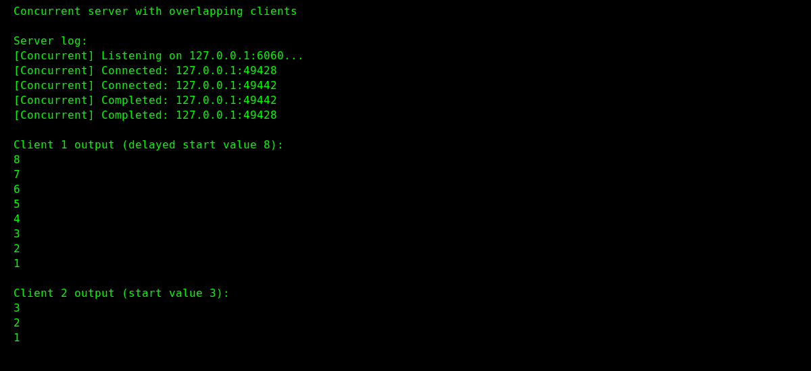
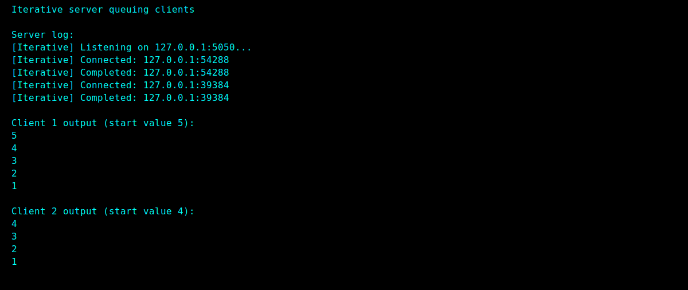

# Sample command transcripts

All commands run from the repository root using Python 3.12 on Linux. The `PYTHONPATH` environment variable is set so Python can locate the project sources.

## Iterative suite

Server:
```text
$ PYTHONPATH=src/main/python python -m countdown.iterative.server 5050 127.0.0.1 --max-clients 1
[Iterative] Listening on 127.0.0.1:5050...
[Iterative] Connected: 127.0.0.1:37284
[Iterative] Completed: 127.0.0.1:37284
```

Client:
```text
$ PYTHONPATH=src/main/python python -m countdown.iterative.client 5 127.0.0.1 5050
5
4
3
2
1
```

## Concurrent suite

Server:
```text
$ PYTHONPATH=src/main/python python -m countdown.concurrent.server 6060 127.0.0.1 --max-clients 2 --max-workers 2
[Concurrent] Listening on 127.0.0.1:6060...
[Concurrent] Connected: 127.0.0.1:49428
[Concurrent] Connected: 127.0.0.1:49442
[Concurrent] Completed: 127.0.0.1:49442
[Concurrent] Completed: 127.0.0.1:49428
```

Client 1:
```text
$ PYTHONPATH=src/main/python python -m countdown.concurrent.client 4 127.0.0.1 6060
4
3
2
1
```

Client 2:
```text
$ PYTHONPATH=src/main/python python -m countdown.concurrent.client 3 127.0.0.1 6060
3
2
1
```

Screenshot evidence of both clients completing concurrently:



## Iterative queuing snapshot (optional)


